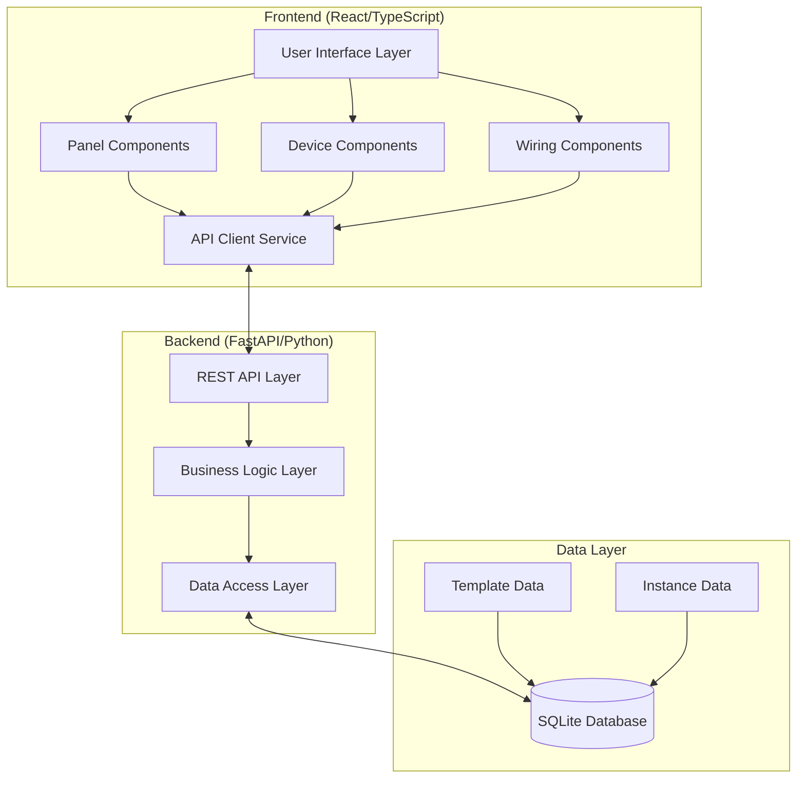
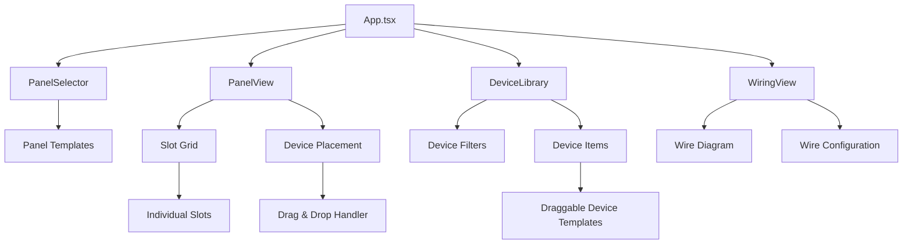
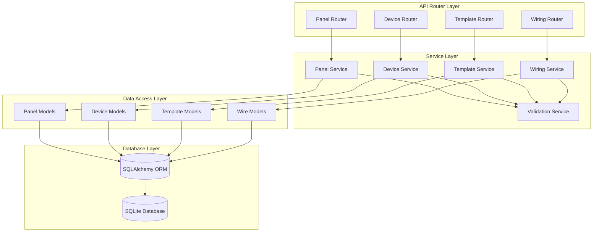
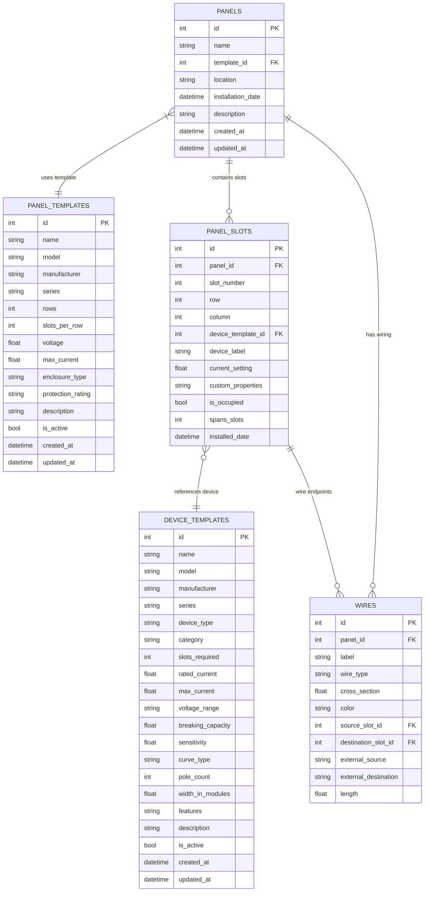
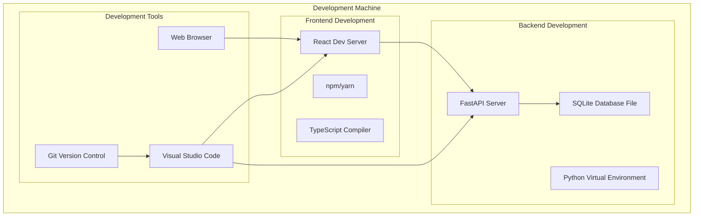
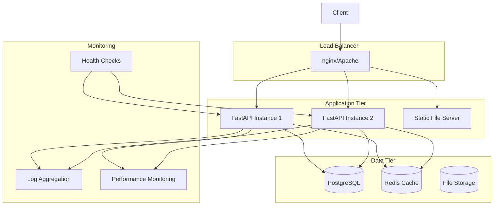
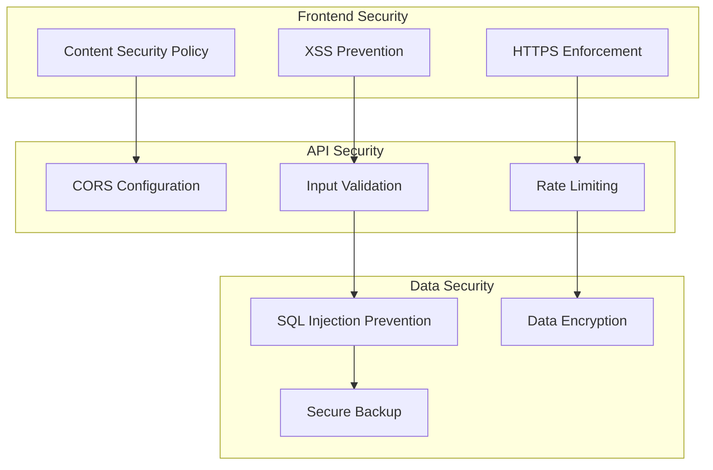

# Software Architecture

## 1. Architecture Overview

The Electrical Panel Configurator follows a modern 3-tier architecture with clear separation between presentation, business logic, and data layers.

### 1.1 Architecture Principles
- **Template-Based Design**: Clear separation between reusable templates and concrete instances
- **Domain-Driven Design**: Business logic organized around electrical engineering concepts
- **REST API Architecture**: Stateless API with clear resource boundaries
- **Component-Based Frontend**: Reusable React components with TypeScript safety

### 1.2 Technology Stack
- **Backend**: Python FastAPI, SQLAlchemy ORM, SQLite database
- **Frontend**: React, TypeScript, Material-UI, React DnD
- **API**: RESTful with OpenAPI documentation
- **Development**: Hot reload, automated testing, code quality tools

## 2. Domain Model

### 2.1 Core Domain Entities

```mermaid
classDiagram
    class PanelTemplate {
        +int id
        +string name
        +string model
        +string manufacturer
        +string series
        +int rows
        +int slots_per_row
        +float voltage
        +float max_current
        +string enclosure_type
        +string protection_rating
        +string description
        +bool is_active
        +datetime created_at
        +datetime updated_at
        +total_slots() int
    }

    class DeviceTemplate {
        +int id
        +string name
        +string model
        +string manufacturer
        +string series
        +string device_type
        +string category
        +int slots_required
        +float rated_current
        +float max_current
        +string voltage_range
        +float breaking_capacity
        +float sensitivity
        +string curve_type
        +int pole_count
        +float width_in_modules
        +string features
        +string description
        +bool is_active
        +datetime created_at
        +datetime updated_at
    }

    class Panel {
        +int id
        +string name
        +int template_id
        +string location
        +datetime installation_date
        +string description
        +datetime created_at
        +datetime updated_at
    }

    class PanelSlot {
        +int id
        +int panel_id
        +int slot_number
        +int row
        +int column
        +int device_template_id
        +string device_label
        +float current_setting
        +string custom_properties
        +bool is_occupied
        +int spans_slots
        +datetime installed_date
    }

    class Wire {
        +int id
        +int panel_id
        +string label
        +string wire_type
        +float cross_section
        +string color
        +int source_slot_id
        +int destination_slot_id
        +string external_source
        +string external_destination
        +float length
    }

    Panel ||--o{ PanelSlot : contains
    Panel }o--|| PanelTemplate : "based on"
    PanelSlot }o--|| DeviceTemplate : "uses"
    Panel ||--o{ Wire : "has wiring"
    PanelSlot ||--o{ Wire : "source/destination"
```

### 2.2 Domain Relationships

- **Template-Instance Pattern**: PanelTemplate/DeviceTemplate define specifications; Panel/PanelSlot are concrete instances
- **Composition**: Panel contains multiple PanelSlots in a grid layout
- **Association**: PanelSlots reference DeviceTemplates for device specifications
- **Aggregation**: Wires connect PanelSlots within or external to panels

## 3. Component Architecture

### 3.1 System Components



### 3.2 Frontend Component Hierarchy



### 3.3 Backend Service Architecture



## 4. Data Architecture

### 4.1 Database Schema



### 4.2 API Design

```mermaid
graph LR
    subgraph "Template APIs"
        T1[GET /api/templates/panel-templates]
        T2[GET /api/templates/device-templates]
        T3[GET /api/templates/library/devices/{manufacturer}]
        T4[POST /api/templates/panel-templates]
    end

    subgraph "Panel APIs"
        P1[GET /api/panels/]
        P2[POST /api/panels/]
        P3[GET /api/panels/{id}]
        P4[PUT /api/panels/{id}]
    end

    subgraph "Device APIs"
        D1[PUT /api/devices/slots/{slot_id}]
        D2[DELETE /api/devices/slots/{slot_id}/device]
        D3[GET /api/devices/slots/{slot_id}/can-place/{template_id}]
    end

    subgraph "Wiring APIs"
        W1[GET /api/wiring/panel/{panel_id}]
        W2[POST /api/wiring/]
        W3[PUT /api/wiring/{wire_id}]
        W4[GET /api/wiring/standards/colors]
    end
```

## 5. Deployment Architecture

### 5.1 Development Environment



### 5.2 Production Deployment (Future)



## 6. Security Architecture

### 6.1 Security Layers



### 6.2 Data Flow Security

- **Input Validation**: All API inputs validated using Pydantic schemas
- **SQL Injection Prevention**: SQLAlchemy ORM with parameterized queries
- **Cross-Site Scripting (XSS)**: React's built-in XSS protection
- **CORS Configuration**: Proper CORS headers for API access
- **Data Integrity**: Foreign key constraints and transaction management

## 7. Performance Considerations

### 7.1 Database Optimization
- **Indexing Strategy**: Primary keys, foreign keys, and frequently queried fields
- **Query Optimization**: Efficient JOINs and relationship loading
- **Connection Pooling**: SQLAlchemy connection pool management
- **Caching**: Template data caching for frequently accessed data

### 7.2 Frontend Performance
- **Component Optimization**: React.memo and useMemo for expensive operations
- **Bundle Optimization**: Code splitting and lazy loading
- **State Management**: Efficient state updates and minimal re-renders
- **API Optimization**: Request batching and response caching

### 7.3 Scalability Patterns
- **Microservices Ready**: Service layer enables future microservice extraction
- **Database Scaling**: Architecture supports read replicas and sharding
- **Caching Strategy**: Template and static data caching
- **Load Balancing**: Stateless API design enables horizontal scaling

---

*Document Version: 1.0*  
*Last Updated: September 2025*